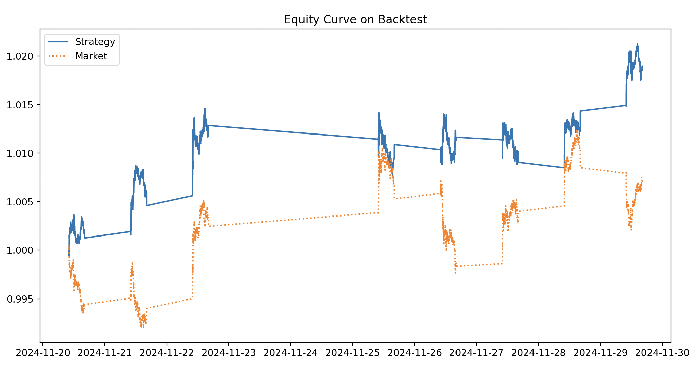

# Python Trading Strategy Back-test

This is a simple script I built to demonstrate back-testing on a variety of basic quantitative strategies.

## Strategies

### Moving Average Crossover (`strategies.MA_crossover`)

Buy when a short-term moving average crosses above a long-term moving average, and sell when it crosses below. Also known as a double crossover strategy.

Parameters:

- `longWindow`: the number of periods that are considered the window for the long-term moving average.
- `shortWindow`: the number of periods that are considered the window for the short-term moving average.

Larger numbers of periods for the moving average tend to lead to a greater smoothing effect, and decreases the impact of newer data on the averages.

The short-termness of a double crossover is determined by the combination of windows used. A 5 day `shortWindow` and 35 day `longWindow` would be deemed short-term, a 50 day `shortWindow` and 200 day `longWindow` would be deemed medium-term or even long-term depending on your interpretation.

### Mean Reversion (`strategies.M_reversion`)

Used to capitalise on significant price movements away from the stock's historical mean. This strategy is upheld by an underlying assumption that stocks will tend to revert towards their long-term average price behaviour.

Use Bollinger Bands to identify a statistically significant movement. Using the upper and lower bands we can identify whether a stock is currently over or undervalued, and sell or buy respectively.

You can also expand these signals to a pairs trading strategy, where two correlated assets are examined and when the difference between the pair's prices becomes significant you short the overvalued asset and go long in the undervalued one.

### Momentum (`strategies.momentum`)

My implementation is incredibly rudimentary, simply buying when percentage price changes between intervals are above a given threshold, and selling otherwise. A real-world implementation of a momentum-based strategy would be much more complex and look at more indicators than merely the price action alone. For example, the Relative Strength Index (RSI) indicates whether a security is being overbought or oversold, which can indicate momentum in the market, and is a common indicator for this strategy.

## The Backtester Itself (`StrategyBacktest`)

Parameters:

- `data` (`pd.DataFrame`) holds historical data with `date` and `close` prices for a given security
- `strategy` (function) the signal generator function for a given strategy which encodes a long (or buy) with a 1, a short (or sell) with -1, and a neutral position with 0
- `**strategyParams` provide all the necessary keyword arguments associated with the `strategy` function

Methods:

- `StrategyBacktest.applyStrategy()` - apply the signal generator across the entire span of `data` provided. This will create a column `position` in the DataFrame which stores the position encoding for that particular datum.

- `StrategyBacktest.calcReturns()` - calculate the return for a portfolio that implemented this strategy on the stock in question.

- `StrategyBacktest.run()` - run both `applyStrategy` and `calcReturns` to perform the backtest

- `StrategyBacktest.perfSummary()` - produce a brief summary of the strategy's performance

- `StrategyBacktest.plot()` - produce an equity plot for the given strategy, describes the value of the portfolio under the strategy, and compares it against the market price movements for the given stock. See an example of the plot below:

